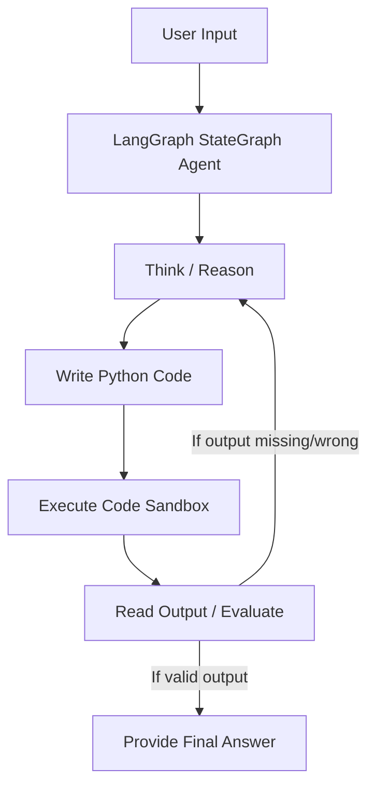

# Reinforcement Learning for LLM Agentic Reasoning

Reproducing DeepSeek-R1 style reasoning using GRPO (Group Relative Policy Optimization) on Qwen2.5-1.5B-Instruct.

[](https://huggingface.co/spaces/mpasha1701/RLVR-Reasoning-Agent)
[](https://huggingface.co/mpasha1701/RLVR-Qwen2.5-1.5B-Agent)
[](https://github.com/mpasha1701/Reinforcement-Learning-for-LLM-Agentic-Reasoning)

## Results

| Phase | Description | Results |
|---|---|---|
| Base | Qwen2.5-1.5B-Instruct on GSM8K | 42% Accuracy |
| Phase 1 | RLVR Training (GRPO) on GSM8K | **58% Accuracy** (+38% relative improvement) |
| Phase 2 | LangGraph ReAct Agent | 6/6 on Custom Benchmark |
| Phase 3 | Multi-Turn GRPO + LangGraph | Reward Curve: 1.855 → **2.540** |

## Architecture



## Project Structure

```
Reinforcement-Learning-for-LLM-Agentic-Reasoning/
├── notebooks/                   # Jupyter notebooks documenting each phase with markdown & results
│   ├── 01_phase1_grpo_training.ipynb
│   ├── 02_phase1_evaluation.ipynb
│   ├── 03_phase2_langgraph_agent.ipynb
│   └── 04_phase3_multiturn_grpo.ipynb
├── src/                         # Core Python implementation
│   ├── train_grpo.py            # Phase 1: Unsloth + TRL GRPOTrainer
│   ├── train_phase3.py          # Phase 3: Custom GRPO implementation with LangGraph
│   ├── agent.py                 # Phase 2: LangGraph ReAct Agent definitions
│   └── evaluate.py              # Evaluator for GSM8K benchmarking
├── results/                     # Metric plots and evaluation outputs
│   ├── training_curves.png
│   └── benchmark_results.png
├── app.py                       # Gradio demo application
├── requirements.txt             # Project dependencies
└── README.md                    # Project documentation
```

## How to Reproduce

### 1. Install Dependencies
```bash
pip install -r requirements.txt
```

### 2. Run Phase 1 Training
```bash
python src/train_grpo.py
```

### 3. Evaluate the Model
```bash
python src/evaluate.py
```

### 4. Run the Gradio App
```bash
python app.py
```

## References
This project builds upon concepts from:
- [DeepSeek-R1: Incentivizing Reasoning Capability in LLMs via Reinforcement Learning](https://arxiv.org/abs/2501.12948)
- [Agent-R1: Agentic Search and Reasoning with Reinforcement Learning](https://arxiv.org/abs/2511.14460)
