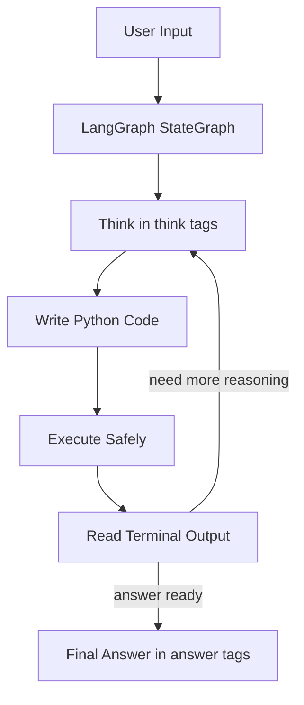

# Reinforcement Learning for LLM Agentic Reasoning

Reproducing DeepSeek-R1 style emergent reasoning using GRPO (Group Relative Policy Optimization) on Qwen2.5-1.5B-Instruct. Built from scratch on free Kaggle GPUs. Zero cost.

[](https://huggingface.co/spaces/mpasha1701/RLVR-Reasoning-Agent)
[](https://huggingface.co/mpasha1701/RLVR-Qwen2.5-1.5B-Agent)
[](https://wandb.ai/mp5272672-netflix/my-rlvr-agent/runs/kzpob7x0)
[](https://wandb.ai/mp5272672-netflix/my-rlvr-agent/runs/trd6ks6h)

---

## Results

| Phase | Description | Result |
|---|---|---|
| Base | Qwen2.5-1.5B-Instruct (no training) | 42% GSM8K |
| Phase 1 | RLVR Training with GRPO | **58% GSM8K (+38% relative)** |
| Phase 2 | LangGraph ReAct Agent | 6/6 custom benchmark |
| Phase 3 | Multi-Turn GRPO on trajectories | Reward 1.855 → **2.540** |

**Key finding:** At step 70, reward jumped from 0.375 → 0.719 in a single interval — the model spontaneously learned `<think>` tag reasoning through pure RL signal. No human-labeled reasoning traces used.

---

## Why Reinforcement Learning?

Standard fine-tuning (SFT) teaches a model to imitate human-written reasoning chains. The problem: you need thousands of labeled examples showing *how* to think, which is expensive and biased toward human reasoning styles.

**RLVR (Reinforcement Learning with Verifiable Rewards) does something different:**

- Give the model a math problem
- Let it generate whatever response it wants
- Check only if the *final answer* is correct — no labels needed
- Reward correct answers, penalize wrong ones
- Repeat thousands of times

The model discovers reasoning strategies *on its own* to maximize reward. This is how DeepSeek-R1 produced o1-level reasoning — not by copying human traces, but by figuring out that thinking step-by-step leads to more correct answers.

---

## What is GRPO?

GRPO (Group Relative Policy Optimization) is a simplified version of PPO that removes the need for a separate critic/value model — making it practical on small hardware.

**The core idea:**

```
For each math problem:
  1. Generate 8 different responses (the "group")
  2. Score each with reward functions
  3. Compute advantage = how much better/worse than group average
  4. Update: increase probability of high-advantage responses
             decrease probability of low-advantage responses
```

**Mathematically:**

```
advantage_i = (reward_i - mean(rewards)) / std(rewards)
loss = -advantage_i * log_prob(response_i)
```

Positive advantage → model learns to do more of this.  
Negative advantage → model learns to do less of this.  
No value network. No critic. Just group statistics.

---

## Reward Design

### Phase 1 — Single Turn

```python
accuracy_reward = 1.0   # final answer matches ground truth
format_reward   = 0.5   # response uses <think> and <answer> tags
# Total range: 0 to 1.5
```

The format reward causes emergent reasoning — the model discovers that structured thinking leads to more correct answers, which leads to higher reward. It learns *why* to think, not just *how*.

### Phase 3 — Trajectory Level

```python
efficiency_penalty = -0.2 * (num_turns - 1)  # fewer turns = better
think_reward       = +0.3                      # structured reasoning
execution_reward   = +1.5                      # code executed correctly  
answer_reward      = +2.5                      # correct final answer
```

The efficiency penalty is critical. Without it, the model learns to loop and re-execute correct code to farm rewards. With it, a clean 1-turn solution scores higher than a 4-turn loop — teaching genuine efficiency.

---

## Architecture

### Phase 1: RLVR Training

```
Math Problem
    |
Generate 8 responses (GRPO group)
    |
Score: accuracy_reward + format_reward
    |
Normalize advantages within group
    |
Policy gradient update
    |
Model learns structured reasoning spontaneously
```

### Phase 2 + 3: Multi-Turn Agent



### Phase 3: How Trajectory GRPO Works

```
Problem → Sample 4 full agent episodes

Episode 1: Think → Code → Execute → Answer  (reward: 2.8)  ← best
Episode 2: Think → Code → Loop → Answer     (reward: 1.4)
Episode 3: Think → Answer directly          (reward: 2.5)  ← efficient
Episode 4: Think → Code → Error → Answer    (reward: 1.1)  ← worst

mean = 1.95, std = 0.68
Advantages: [+1.25, -0.81, +0.81, -1.25]

Update: encourage Episodes 1 and 3
        discourage Episodes 2 and 4
```

The model learns when to reason directly vs use tools, and how to terminate cleanly after getting the answer.

---

## Training Details

| Setting | Phase 1 | Phase 3 |
|---------|---------|---------|
| Base model | Qwen2.5-1.5B-Instruct | Phase 1 checkpoint |
| Algorithm | TRL GRPOTrainer | Custom GRPO loop |
| Dataset | GSM8K (500 examples) | GSM8K (80 problems) |
| Steps | 500 | 80 |
| Group size | 8 responses | 4 trajectories |
| Learning rate | 5e-6 | 1e-5 |
| LoRA rank | 16 | 16 |
| Hardware | 2x Kaggle T4 (free) | 2x Kaggle T4 (free) |
| Training time | ~3.5 hours | ~7 hours |
| Cost | **$0** | **$0** |

---

## Project Structure

```
Reinforcement-Learning-for-LLM-Agentic-Reasoning/
├── notebooks/
│   ├── 01_phase1_grpo_training.ipynb     <- GRPO training with output logs
│   ├── 02_phase1_evaluation.ipynb        <- 58% vs 42% baseline comparison
│   ├── 03_phase2_langgraph_agent.ipynb   <- Agent with 6/6 benchmark
│   └── 04_phase3_multiturn_grpo.ipynb    <- Multi-turn GRPO + reward curves
├── src/
│   ├── train_grpo.py                     <- Phase 1 GRPO training
│   ├── train_phase3.py                   <- Phase 3 multi-turn GRPO
│   ├── agent.py                          <- LangGraph ReAct agent
│   └── evaluate.py                       <- Evaluation vs baseline
├── app.py                                <- Gradio demo
├── requirements.txt
└── README.md
```

---

## How to Reproduce

```bash
pip install -r requirements.txt

# Phase 1: RLVR training
torchrun --nproc_per_node=2 src/train_grpo.py

# Phase 3: Multi-turn agent RL
torchrun --nproc_per_node=2 src/train_phase3.py

# Evaluate
python src/evaluate.py

# Demo
python app.py
```

---

## Stack

`PyTorch` · `Unsloth` · `TRL` · `HuggingFace Transformers` · `LangGraph` · `Gradio` · `WandB`

---

## References

- DeepSeek-R1: [arXiv:2501.12948](https://arxiv.org/abs/2501.12948)
- Agent-R1: [arXiv:2511.14460](https://arxiv.org/abs/2511.14460)
- Open-R1: [HuggingFace Blog](https://huggingface.co/blog/open-r1)
